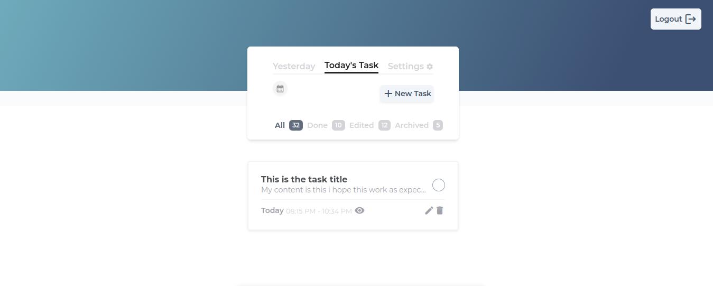
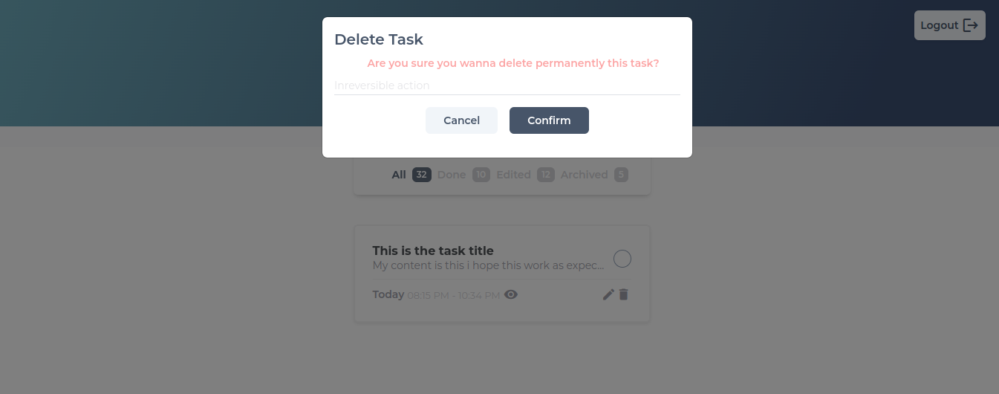
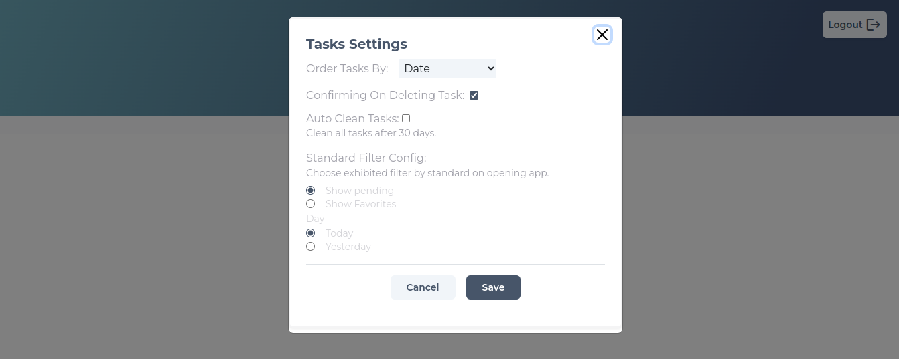

<div align="center">
  <h1>TASKER</h1>
</div>
<br />
<!-- TABLE OF CONTENTS -->
<details>
  <summary>Table of Contents</summary>
  <ol>
    <li>
      <a href="#about-the-project">About The Project</a>
      <ul>
        <li><a href="#built-with">Built With</a></li>
      </ul>
    </li>
    <li>
      <a href="#getting-started">Getting Started</a>
      <ul>
        <li><a href="#prerequisites">Prerequisites</a></li>
        <li><a href="#installation">Installation</a></li>
      </ul>
    </li>
    <li><a href="#usage">Usage</a></li>
    <li><a href="#roadmap">Roadmap</a></li>
    <li><a href="#contributing">Contributing</a></li>
    <li><a href="#license">License</a></li>
    <li><a href="#contact">Contact</a></li>
    <li><a href="#acknowledgments">Acknowledgments</a></li>
  </ol>
</details>


<!-- ABOUT THE PROJECT -->
## About The Project

Tasker is todo app to help you manage your daily tasks.

## why?

* Organization and  registration of daily tasks: This app was created with an intuitive interface for common users for easily task creation.


### Built With

* Javascript;
* Angular;
* Css;
* Angular Animations;
* Ng-Bootstrap Library;
* API REST Consuming;

<p align="right">(<a href="#readme-top">back to top</a>)</p>


<!-- GETTING STARTED -->
## Getting Started

### Prerequisites

Ensure your have installed on your machine: Editor (Ex: Vscode), nodeJS, npm(or preferencial), angular-cli.
<!-- 
* npm
  ```sh
  npm install npm@latest -g
  ``` -->

### Installation

1. Clone the repo
   ```sh
   git clone https://github.com/marionorberto/tasker.git
   ```
2. Install NPM packages:
   ```sh
   npm install
   ```
3. run app:
  ```sh
   ng s
   ```
4. Run the migrations

<p align="right">(<a href="#readme-top">back to top</a>)</p>


<!-- USAGE EXAMPLES -->
## Usage

The main use of this web app is to create tasks and consulting them. 

* main page:





* Create New Tasks:


* Remove Taskes:





* settings Tasks:




<p align="right">(<a href="#readme-top">back to top</a>)</p>


<!-- CONTRIBUTING -->
## Contributing
If you have a suggestion that would make this better, please fork the repo and create a pull request. You can also simply open an issue with the tag "enhancement".
Don't forget to give the project a star! Thanks again!

1. Fork the Project
2. Create your Feature Branch (`git checkout -b feature/AmazingFeature`)
3. Commit your Changes (`git commit -m 'Add some AmazingFeature'`)
4. Push to the Branch (`git push origin feature/AmazingFeature`)
5. Open a Pull Request

<p align="right">(<a href="#readme-top">back to top</a>)</p>

<!-- LICENSE -->
## License
Distributed under the MIT License.

## Contact

Mário Norberto - [@marionorberto](https://linkedin.com/in/marionorberto) - marionorberto2018@gmail.com

Project Link: [https://github.com/marionorberto/tasker](https://github.com/marionorberto/tasker)

<p align="right">(<a href="#readme-top">back to top</a>)</p>

